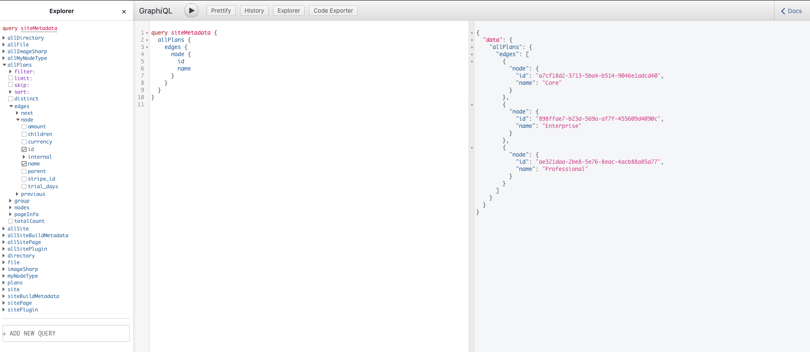

# Gatsby Firebase Source

Quick and dirty firebase source for Gatsby. Allows you to query your firebase data right into your statically generated pages with Gatsby.



## Usage

1. First thing first, you need to generate a Private Key from Firebase, find out how to get it from this link https://firebase.google.com/docs/admin/setup (or click the settings gear > Service accounts tab > Generate New Private Key button at the bottom)

2. Place that private key .json file somewhere in your gatsby project, or in specific folder you decided it's for settings

3. Configure gatsby-config.js


```js
// the plugin options are:
{
  credential,
  databaseURL,
  types: [{
    graphQl,
    collection,
    limit
  }]
}

// Here's an example:

module.exports = {
  // the rest of your config
  plugins: [
    {
      resolve: `gatsby-source-firebase`,
      options: {
        // point to the firebase private key downloaded
        credential: require("./firebase-key.json"),

        // your firebase database root url
        databaseURL: "https://xxxxxx-xxxxx.firebaseio.com",

        // you can have multiple "types" that point to different paths
        documents: [
          {
            // it'll become `allPlans` in graphql
            graphQl: "Plans",

            // collection name 
            collection: "plans",

            // setup the limits
            limit: 3
          }
        ]
      }
    }
  ]
}
```

Enjoy!
